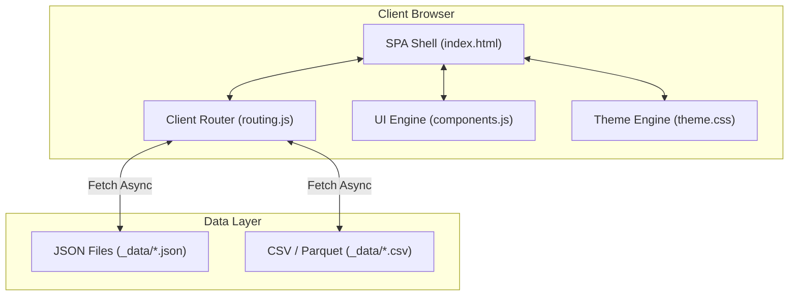

# Overall Architecture & Design Overhaul Proposal

The most effective way to eliminate eye strain, resolve performance issues (like loading 21MB files), and improve usability is to transition from **multiple static, code-duplicated HTML files** to a **decoupled, Single-Page Application (SPA) architecture**.

Below is the proposal for a complete overhaul, detailing the **Architectural Shifts**, **Dashboard Re-designs**, and **Modern Interactivity Layers**.

---

## The Overhaul Architecture

---

## 1. Unified Single-Page Application (SPA) Shell
* **What changes:** Replace the 20+ separate HTML files (`overdraw.html`, `draws_by_class.html`, drill reports, etc.) with a single, lightweight entry point (`index.html`) in the root.
* **How it works:**
  * The root HTML shell loads a single stylesheet (`theme.css`) and JavaScript bundle (`app.js`).
  * A client-side router matches the URL hash (e.g., `#/dashboard`, `#/catalog`, `#/drill/Chor_bazar/2026-06-01`) and dynamically renders the matching template view.
* **Why it helps:**
  * **Zero White-Screen Flashes:** Moving between reports is instant and animated.
  * **Centralized Design System:** Enforcing a layout change (like theme colors or spacing) is done once in `theme.css` and updates all reports simultaneously.

## 2. Decoupled, Asynchronous Data Loading
* **What changes:** Move the heavy datasets (such as the 21MB catalog/drill rows) completely out of the HTML.
* **How it works:**
  * The offline generation pipeline outputs standard, minified JSON files (e.g., `_data/drill_chor_bazar_2026-05-25.json`) alongside the CSV/Parquet files.
  * The SPA Shell renders immediately (under 10ms) showing skeleton loading cards, then executes an asynchronous `fetch()` call to load the requested JSON dataset in the background.
* **Why it helps:**
  * **Instant TTI (Time-to-Interactive):** The page never freezes up because the browser parses a tiny layout shell rather than megabytes of inline HTML table rows.
  * **Optimized Bandwidth:** The browser only downloads the specific dataset the user wants to inspect.

## 3. The "Aero Glass" Design System (Theme & UX)
* **What changes:** A complete visual revamp focusing on depth, spacing, typography, and contrast.
* **Visual Styling:**
  * **Frosted Glass Containers:** Apply semi-transparent surface card overlays using `backdrop-filter: blur(12px)` and thin OKLCH borders.
  * **Respaced Tables:** Increase row heights to `38px` and add Zebra striping using light-dark transparency, providing visual resting points for tracking rows.
  * **Dual Typography:** Use sans-serif (`Inter`) for readability (names, dates, statuses, labels) and tabular monospace *strictly* for numeric columns.

## 4. Advanced Interactive Dashboards
To replace raw column dumps, we introduce three core interactive features:

### A. The KPI Widget Grid
The top of the dashboard should feature interactive metric tiles:

| Tile Type | Content | Action |
| :--- | :--- | :--- |
| **Workload Spark** | Total draws & dispatch counts, with a mini trendline spark chart. | Click to zoom/filter workload charts. |
| **Shader Hotlist** | Count of compiled vs changed shaders in the latest drop. | Click to filter the main table to dirty shaders. |
| **Replay Status** | Status checks. Green checkmarks for `ok`, red alerts for fails. | Click to hide/show failed capture rows. |

### B. Collapsible Category Tables & Cell Bars
* **Column Folders:** Group the 37 columns into collapsible categories (e.g., Workload, Pipelines, Textures, Buffers) that you can open/close with one click.
* **Visual Value Intensity:** Cells are filled with a soft horizontal bar representing their relative value weight. You can scan down a table of 1,000 shaders and immediately spot the heaviest ones by looking for the longest blue bar.

### C. Drop Comparison Mode (Diffs)
* Provide a checkbox selector on the catalog view: **[Compare Drop A to Drop B]**.
* Selecting two drops generates a comparison table showing the delta differences (e.g. `+14 draws`, `-2 shaders`), color-coded by performance impact (green for improvement, red for regression).
