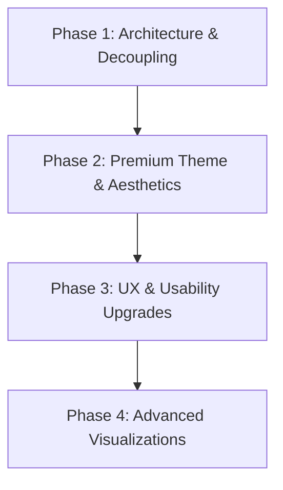

# Performance Capture Analysis Catalog & Reports Review

We conducted a comprehensive review of the current capture analysis catalog HTML files (`index.html`, `_reports/index.html`, and drill-down reports like `_reports/drill/.../index.html`). 

Below is a detailed breakdown of findings across **Look & Feel, Readability, UX, Presentation, Quality, and CSS**, followed by a **Stage-by-Stage Roadmap** for transforming the visual themes, usability, and performance.

---

## Detailed Review Findings

### 1. CSS & Theme System
* **Current State:** The theme uses modern CSS features like CSS custom properties (variables), the `light-dark()` color scheme function, and perceptual colors (`oklch()`).
* **Critique:**
  * **Massive Code Duplication:** Each report file (including root `index.html` and everything in `_reports/`) duplicates the same `style` tag and **90KB+ base64-encoded `Inter` font block**. This is a major anti-pattern. If you have dozens of runs and runs-over-runs, this duplicates megabytes of identical styling data, blocks browser caches, and makes design updates extremely difficult.
  - **No Theme Fallbacks:** Using `light-dark()` directly without fallback variables means browsers without native `light-dark()` support (older browsers or Chromium versions) will fall back to default black/white browser styles, breaking the custom aesthetic.
  - **Lack of Variable Consistency:** Some layout elements hardcode pixel paddings and margins instead of utilizing the spacing scale (`--sp-1` to `--sp-12`).

### 2. Look & Feel (Aesthetics)
* **Current State:** The pages are flat, functional, and developer-oriented.
* **Critique:**
  * **Flat & Basic Design:** The dashboard looks like a standard console without depth, harmony, or personality. It lacks visual hierarchies, drop shadows, or gradient highlights.
  - **Monotone Typography:** While `Inter` is a great sans-serif, monospace font configurations are applied broadly to navigation (`nav.toc`), KPIs, details tabs, and controls. Using monospace for labels, navigation, and structural tags makes the UI feel cramped and clinical. Reserving monospace exclusively for tabular numbers, keys, and hashes (e.g. shader/texture/buffer IDs) and using a crisp sans-serif everywhere else would look much more premium.
  - **Status Accents:** OKLCH values for warnings (`--status-warn`), errors (`--status-alarm`), and success (`--pos`) are currently harsh and flat. They would benefit from a softer palette with glassmorphism backdrops (translucent color tags).

### 3. Readability & UX (Usability)
* **Current State:** Uses monospace text inside tabular displays, has basic filtering/sorting, and sticky table headers.
* **Critique:**
  * **Extreme Table Density:** Table rows are highly compressed (e.g. `22px` height in virtualized table rows). The lack of visual spacing, clear cell borders, or hover guidance makes reading across dozens of columns exhausting.
  - **KPIs Lack Context:** The KPI chips in `.kpi-strip` are simple boxes. They do not show tooltips explaining the metric, don't show sparklines (trend indicators), and are not interactive (clicking them does not filter/pivot the table).
  - **Hardcoded Header Offsets:** Sticky headers use hardcoded offsets (e.g. `top: var(--hdr-offset)`), which break if the screen width shrinks and header wraps, or on mobile viewports.
  - **Absence of Global Search:** Filtering is strictly per-table. There is no unified search bar to quickly find an area, shader ID, or drop date globally.
  - **Harsh Details Disclosures:** Expansion elements (`details`) toggle instantly. Lacking micro-animations or layout transitions, the page layout changes feel jarring.

### 4. Code Quality & Performance (Architecture)
* **Current State:** Heavy HTML files that embed data inside `<script>` blocks (e.g., drill indexes are 21MB+ in size).
* **Critique:**
  * **21MB HTML Files:** Storing massive data payloads directly inside raw HTML scripts blocks forces the browser's DOM parser to block execution while parsing megabytes of JS data before showing the UI shell. This leads to slow Time-To-Interactive (TTI).
  - **Data Coupled with View:** Because data is baked directly into the report HTML, it's impossible to reuse layout logic or swap datasets dynamically.
  - **Inline Scripts:** Interleaved layout and logic scripts prevent the application of strict Content Security Policies (CSP) and lead to maintenance challenges.

---

## Roadmap to an Improved Report Theme & Design

We propose a **4-Phase Roadmap** to decouple the architecture, introduce premium modern aesthetics, refine usability, and add advanced interactive visualizations.



### Stage 1: Architecture & Asset Decoupling (High Priority)
Before rewriting CSS styling, we must separate the presentation layer, the logical script layer, and the data layer.

1. **Create Shared Assets:**
   * Extract CSS code to a single shared file: `/assets/style.css`.
   * Extract JS engine logic (like `VTable` and `jumpToTable`) to `/assets/app.js`.
   * Reference them inside report HTML files via standard linking `<link rel="stylesheet" href="/assets/style.css">`.
2. **Externalize Font Loading:**
   * Move the base64-encoded `Inter` font block into a separate `/assets/fonts.css` file or load it via standard webfont URLs with local fallbacks. This reduces the weight of every HTML file by ~90KB.
3. **Decouple Data Payloads (Lazy Load Data):**
   * Instead of embedding `window.__data_catalog` directly in HTML, dump datasets into `.json` (or `.parquet`) files in a subfolder (e.g., `_data/catalog.json`).
   * Modify `/assets/app.js` to render a clean skeleton loader instantly, load the JSON asynchronously using `fetch()`, and feed the virtual table. This cuts page load times from seconds to milliseconds.

### Stage 2: Premium Theme & Aesthetics (Look & Feel)
Redefining the design language to align with modern, state-of-the-art web apps.

1. **Harmonious Typography:**
   * Change body, header, and KPI typography to a clean sans-serif (e.g. `Inter` or `Outfit` from Google Fonts).
   * Restrict monospace (`ui-monospace, SFMono-Regular, Cascadia Code`) solely to numeric outputs, code-blocks, hashes, and resource IDs.
2. **Glassmorphism & Depth System:**
   * Introduce a depth system with subtle shadows and translucent backdrops:
     ```css
     --backdrop-blur: blur(8px);
     --surface-translucent: light-dark(oklch(100% 0 0 / 0.7), oklch(20% 0.01 260 / 0.7));
     --border-light: light-dark(oklch(90% 0.01 80 / 0.4), oklch(30% 0.01 260 / 0.4));
     ```
   * Style header strips, sticky tables, and popup sidecars with frosted glass borders and `backdrop-filter: var(--backdrop-blur)`.
3. **Refined OKLCH Palette & Gradients:**
   * Replace flat border colors and solid fills with soft gradients.
   * Soften indicator labels (warnings, errors, info) using subtle background tints (e.g., a warning has a very light yellow backdrop, rather than bright bold warning text).
   * Implement a clean "Accent" color gradient (e.g., Deep Indigo to Violet) for focus states and highlights.

### Stage 3: UX & Usability Upgrades (Readability)
Improving reading comfort and interactive features.

1. **Enhanced Table Aesthetics:**
   * Increase VTable row heights to `32px` or `36px` to give cells room to breathe.
   * Add a soft vertical border-left to sticky primary columns.
   * Highlight active rows with dynamic borders and subtle zoom scales (`scale(1.005)`).
2. **Interactive KPI Cards:**
   * Turn the KPI chips into hoverable cards.
   * Add **interactive metrics filters**: clicking a KPI card (e.g., "7 areas", "14 alarm rows") dynamically filters the table below to show only relevant rows.
3. **Adaptive Sticky Headers:**
   * Use JavaScript `IntersectionObserver` or CSS `position: sticky` on wrapper containers to calculate header heights dynamically, resolving viewport overlapping bugs.
4. **Micro-Animations:**
   * Apply CSS transitions on toggles (`details` tag transitions utilizing `@starting-style` where supported).
   * Animate hover states of tables, sidebar links, and crumb buttons with elastic transitions (`transition: all 0.25s cubic-bezier(0.2, 0.8, 0.2, 1)`).

### Stage 4: Advanced Visualizations & Analytics
Replacing basic vectors with rich charts and helper components.

1. **Interactive Charts:**
   * Replace flat SVGs with interactive SVG charts styled using CSS custom properties.
   * Support tooltips that reveal exact data values on mouse hover.
2. **Embed Sparklines:**
   * Include mini sparkline trend charts inside KPI cards and table rows, displaying how a capture's parameters evolved across the latest drops.
3. **Sidecar Inspector Panels:**
   * When clicking a row or resource ID (like a shader or FBO), slide in a slick **sidecar drawer panel** from the right, showing detailed code, bindings, and resource descriptions in a readable code editor look, instead of forcing a page jump.
